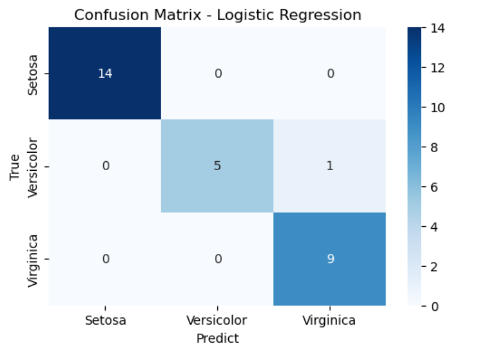
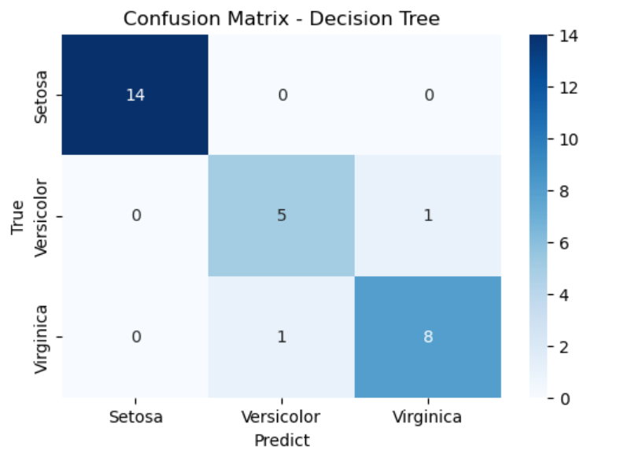
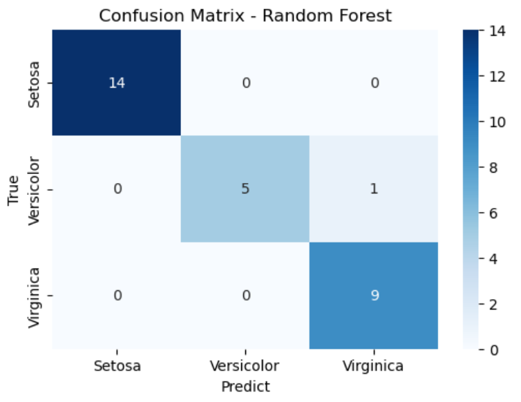
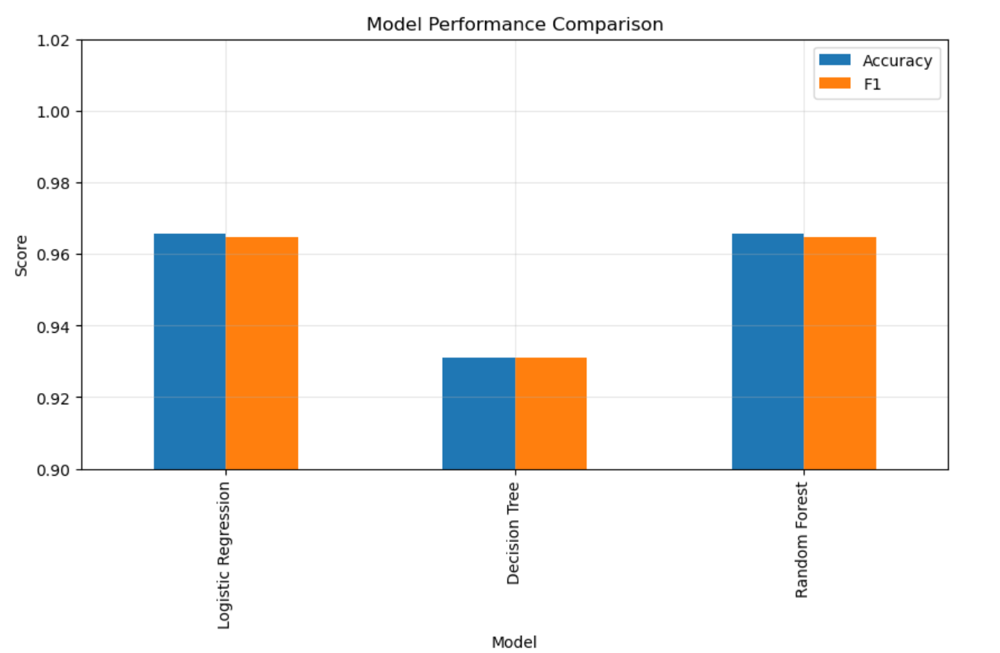

# Iris Dataset Classification with Apache Spark MLlib
**Student ID**: P156872  
**Name**: LIANG HAIZHU  
**Course**: STQD6324 Data Management  
**Assignment**: Assignment 1

---
## Project Overview

This project implements a complete classification pipeline on the classic **Iris dataset** using **Apache Spark MLlib**. Three classification algorithms are trained, tuned, and compared:

- Logistic Regression  
- Decision Tree
- Random Forest

All models are optimised via **grid search** combined with **5‑fold cross‑validation**. Performance is evaluated using `accuracy`, `precision`, `recall`, and `F1‑score`. The best model is justified comprehensively.

---

## Dataset Description

- **Name**: Iris Dataset
- **Source**: [UCI Machine Learning Repository](https://archive.ics.uci.edu/ml/datasets/iris)  
- **Samples**: 150 instances, balanced (50 per class)  
- **Features**: 4 continuous numeric attributes (unit: cm)  
  - Sepal length, Sepal width  
  - Petal length, Petal width  
- **Classes**: Iris Setosa, Iris Versicolor, Iris Virginica  
- **Characteristics**:
  - No missing values.
  - Setosa is completely linearly separable from the other two species.
  - Versicolor and Virginica exhibit natural feature overlap and are non‑linearly separable.

---

## Methodology

### 1. Environment & Spark Session  
Python libraries: `pyspark`, `pandas`, `matplotlib`, `seaborn`, `requests`.  
SparkSession created with app name `"Iris"`.

### 2. Data Loading & Exploration  
The dataset is loaded from a public CSV URL with automatic schema inference. Basic exploratory analysis is performed to understand the data structure.

### 3. Preprocessing  
- **Label encoding**: `StringIndexer` → numeric labels (Setosa=0, Versicolor=1, Virginica=2).  
- **Feature assembly**: `VectorAssembler` → single `features` column.

### 4. Train‑Test Split  
- 80% training, 20% testing using `randomSplit([0.8, 0.2], seed=123)`.  
- Result: **121 training, 29 test samples**.  
- Fixed seed ensures the test set size is close to the expected 20% (≈30) for stable evaluation.

### 5. Base Model Definition  
- `LogisticRegression` (family="multinomial")  
- `DecisionTreeClassifier`  
- `RandomForestClassifier` (initial `numTrees=50`, fixed `seed=123` for reproducibility)  

> **Note**: These are initial baseline parameters, which will be further tuned via grid search.
> To ensure full reproducibility, a fixed `seed=123` is set for Random Forest, as it relies on random bootstrap sampling.
> Logistic Regression and Decision Tree are deterministic algorithms and do not require a seed for consistent results.

### 6. Model Tuning: Grid Search & Cross‑Validation  

**Evaluator**: `MulticlassClassificationEvaluator` (metric = accuracy).  
**Cross‑validation**: 5 folds – reliable for small datasets.  
**Parallelism**: 4 tasks to accelerate grid search.  
**Reproducibility**: `seed=123` passed to `CrossValidator` for consistent fold splits.

#### Hyperparameter Grids

| Model | Parameter | Candidate Values |
|-------|-----------|------------------|
| **Logistic Regression** | `regParam`<br>`elasticNetParam`<br>`maxIter` | `[0.01, 0.1, 1.0]`<br>`[0.0, 0.5, 1.0]`<br>`[10, 20, 50]` |
| **Decision Tree** | `maxDepth`<br>`maxBins`<br>`minInstancesPerNode` | `[3, 5, 10]`<br>`[8, 16, 32]`<br>`[1, 2, 5]` |
| **Random Forest** | `numTrees`<br>`maxDepth`<br>`maxBins` | `[10, 20, 50]`<br>`[3, 5, 10]`<br>`[8, 16, 32]` |

#### Optimal Hyperparameters (after cross‑validation)

| Model | Best Parameters |
|-------|------------------|
| Logistic Regression | `regParam=0.01`, `elasticNetParam=0.0`, `maxIter=10`<br>(mild L2 regularisation, fast convergence) |
| Decision Tree | `maxDepth=5`, `maxBins=32`, `minInstancesPerNode=1`<br>(moderate depth, fine‑grained bins) |
| Random Forest | `numTrees=20`, `maxDepth=3`, `maxBins=16`<br>(small ensemble, shallow trees) |

### 7. Model Evaluation  
- Metrics: Accuracy, Weighted Precision, Weighted Recall, F1‑Score.  
- A reusable `evaluate_model` function computes all metrics.  
- Confusion matrices visualised using Seaborn.  
- Sample predictions (first 5 test instances) displayed with probability vectors.

### 8. Comparative Analysis  
- Performance table & bar chart.  
- Strengths and limitations of each model discussed.  
- Best model justified.

---

## Results & Key Findings

### Test Set Performance (29 samples)

| Model | Accuracy | Precision | Recall | F1‑Score |
|-------|----------|-----------|--------|----------|
| **Logistic Regression** | **0.9655** | **0.9690** | **0.9655** | **0.9649** |
| Decision Tree | 0.9310 | 0.9310 | 0.9310 | 0.9310 |
| **Random Forest** | **0.9655** | **0.9690** | **0.9655** | **0.9649** |

### Confusion Matrix Summary

Each model’s confusion matrix visualises classification performance, with key observations below:

#### Logistic Regression
  

- **1 misclassification**:
- One Versicolor sample was incorrectly predicted as Virginica.
- Class-wise performance: Setosa (14/14), Versicolor (5/6), Virginica (9/9).

---

#### Decision Tree
  

- **2 misclassifications**: 
  1. One Versicolor sample predicted as Virginica
  2. One Virginica sample predicted as Versicolor
- Class-wise performance: Setosa (14/14), Versicolor (5/6), Virginica (8/9).

---

#### Random Forest
  

- **1 misclassification**:
- One Versicolor sample was incorrectly predicted as Virginica.
- Class-wise performance: Setosa (14/14), Versicolor (5/6), Virginica (9/9).

---

### Model Performance Comparison

The bar chart below summarises the test set performance of all three models, comparing **Accuracy** and **F1-Score**:



- Logistic Regression and Random Forest perform **identically**, with both Accuracy and F1-score around 0.965.
- The Decision Tree performs **noticeably lower**, with both metrics around 0.931.
- This shows that Logistic Regression and Random Forest are the top-performing models on this dataset.

---

### Model Strengths & Limitations

| Model | Strengths | Limitations |
|-------|-----------|--------------|
| **Logistic Regression** | High accuracy (0.9655), simple & fast, interpretable probabilities | Only linear boundaries, cannot capture complex non‑linear patterns |
| **Decision Tree** | Non‑linear, transparent rules, no feature scaling needed | Lower accuracy (0.9310), overfitting‑prone, unstable |
| **Random Forest** | Matches logistic regression accuracy, ensemble reduces overfitting, robust to noise | More complex, slower to train, less interpretable |

### Best Model Justification

**Logistic Regression** is selected as the optimal model because:

1. It achieves the **highest accuracy (0.9655)** – tied with Random Forest.  
2. It is **simpler, faster to train, and more interpretable** than Random Forest.  
3. The Iris dataset is nearly linearly separable, making a linear model both sufficient and efficient.

---

## How to Reproduce the Analysis

### Prerequisites
- Python 3.8+
- Install required libraries:
```bash
  pip install pyspark pandas matplotlib seaborn

### Steps
1. Open the notebook: P156872_LIANG_HAIZHU_Iris_SparkMLlib.ipynb
2. Run all cells sequentially
3. Results are reproducible with fixed random seeds
